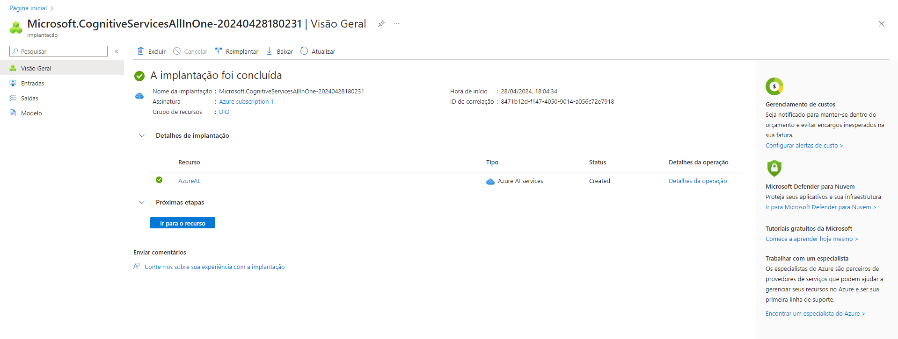
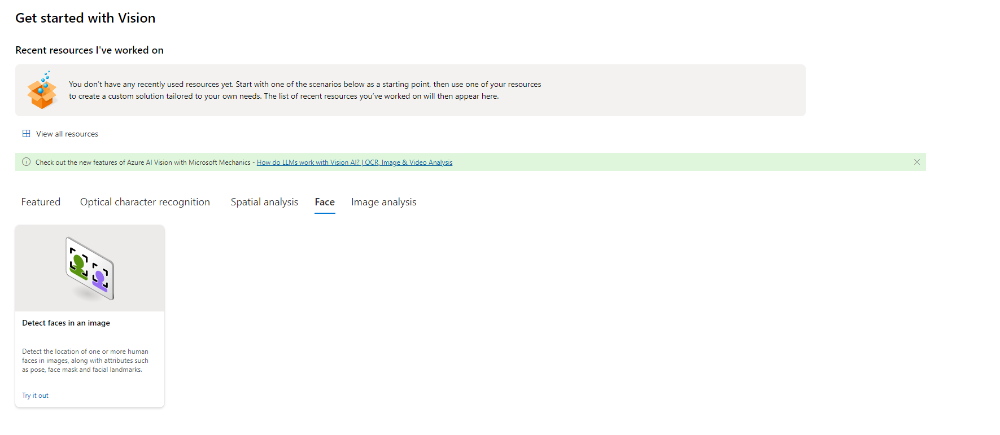
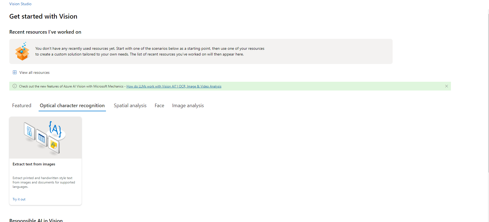
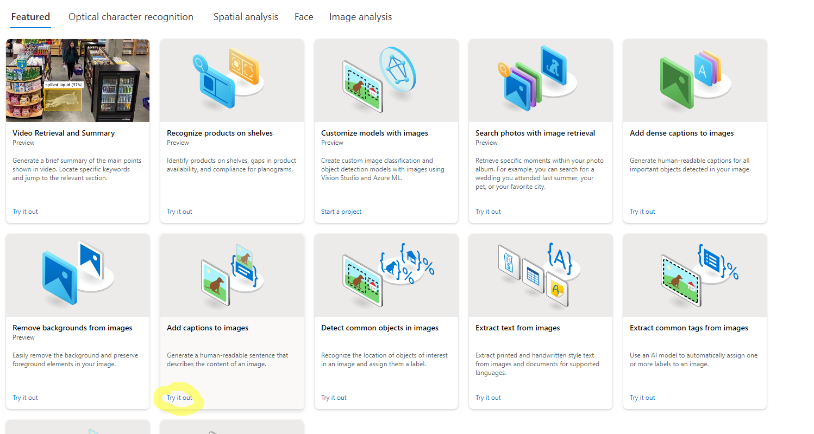

# AzureDioFacial 🏴󠁭󠁤󠁩󠁡󠁿
Entrega de projeto para o bootcamp microsoft IA-900

# 🛠️ INSTRUÇÕES ENTREGA DO PROJETO: 

1. Crie um novo repositório no github com um nome a sua preferência
2. Crie uma pasta chamada 'inputs' e salve as imagens que você utilizou
3. Crie uma pasta chamado 'output' e salve os resultados de reconhecimento de texto nessas imagens
4. Crie um arquivo chamado readme.md , deixe alguns prints descreva o processo, alguns insights e possibilidades que você aprendeu durante o conteúdo.
5. Compartilhe conosco o link desse repositório através do botão 'entregar projeto'

## 💻 RESUMO DA ATIVIDADE 💻 

- **1- Criar uma recurso para acessar o Vision**: 

Após criar um recurso específico (Azuere AI Services):  entrei no link para iniciar minhas atividades no laboratório designado para o Azure AI Services (https://portal.vision.cognitive.azure.com/)

- **2- Usando o Vision e seus recursos**: 

1) O primeiro recurso utilizado foi o 'Reconhecimento de face' 

Com ele, segui as orientações da professora, e escolhi duas imagens para fazer a o reconhecimento de face

Exemplo 1:

Exemplo 2:

2) O seugndo recurso utilizado foi o 'Reconhecimento de texto' 

Com ele, segui as orientações da professora, e escolhi duas imagens para fazer a o reconhecimento de texto

Exemplo 1:

Exemplo 2:

3) O terceiro recurso utilizado foi o 'Reconhecimento de imagem' 

com ele segui as orientações da professora, e escolhi duas imagens para fazer a o reconhecimento de imagem

Exemplo 1:

Exemplo 2:

## ✍🏻 CONSIDERAÇÕES FINAIS:

Com o material que foi extraído da aula, podemos ver a importância do reconhecimento da IA, seja ela para pegar textos de uma imagem, e decifrar um diário apenas por fotos, ou, até mesmo ajudar os meios de segurança pública (polícia e etc) a identificar procurados!

